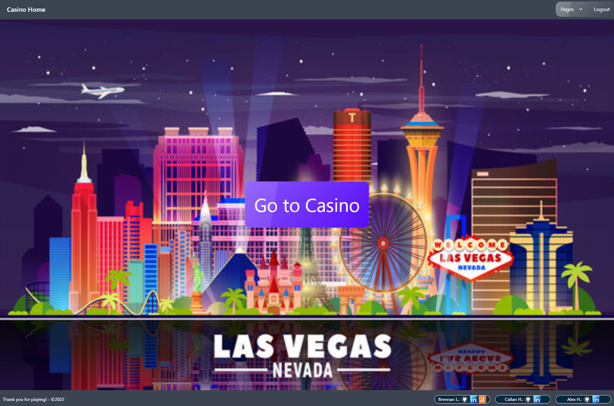
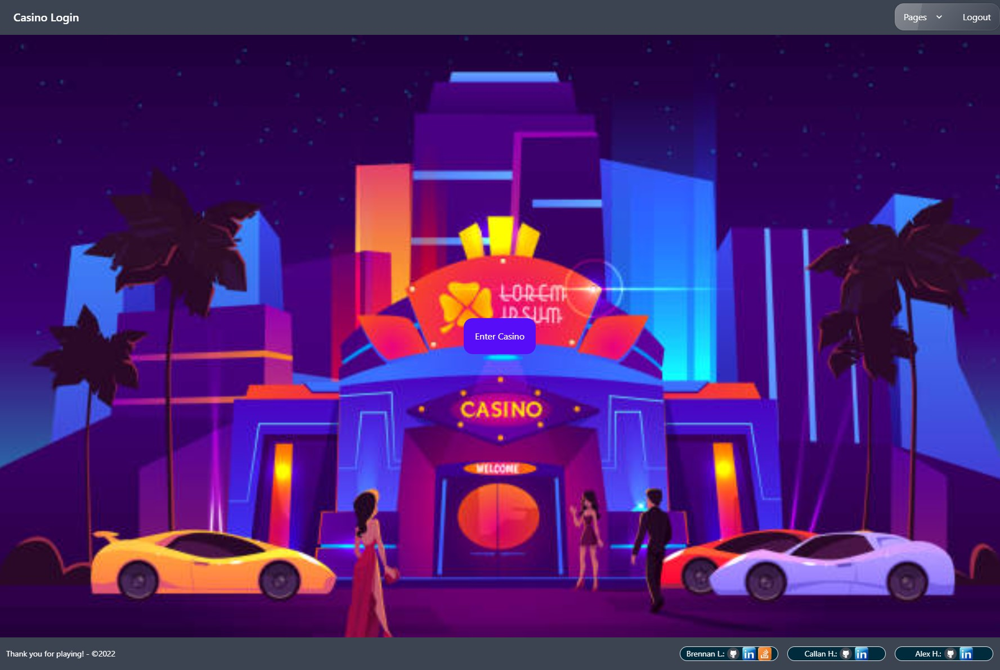
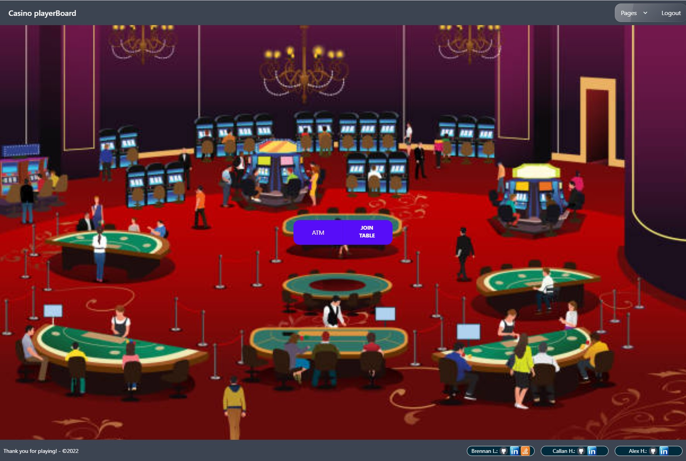
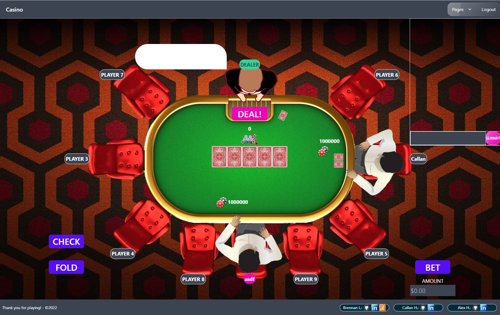

# Casino

## Description

Welcome to your at home Casino experience.


## Link to Deployed Application

[Click to view the deployed application](https://ancient-bayou-45800.herokuapp.com/)


## Table of contents

- [Technologies Employed](#technologies-employed)
- [Final Product](#final-product)
- [License](#license)
- [Contact/Questions](#questions)
- [Summary](#summary-and-learning-points)

## Technologies Employed

| Techlogy             | Implementation/Use       |
| -------------------- | ------------------------ |
| Node.js              | JavaScript runtime       |
| Node Package Manager | Manage node packages     |
| Atlas                | Environment Variables    |
| Express.js           | Web framework            |
| MongoDB & GraphQL    | ORM                      |
| bcrypt               | password encryption      |
| Heroku               | Deployment               |
| Tailwind             | 3rd Party API            |


### Game Mechanics - The Brain


* COMPUTER LOGIC
```javascript
const computerAction = () => {
    console.log('computerAction function initiated');
    let delay = (Math.floor((Math.random() * 4) + 1) * 1000);
    const decision = Math.floor((Math.random() * 5) + 1);
    console.log('computers decision number: ' + decision);
    let computersUpperLimit = 1;
    if (playerChipStack > computerChipStack) {
      computersUpperLimit = computerChipStack / 5;
    } else {
      computersUpperLimit = playerChipStack / 5;
    }
    if (computersUpperLimit < varCurrentAmount) {
      computersUpperLimit = varCurrentAmount;
    }
    let computerBet = Math.floor(Math.random() * (computersUpperLimit - varCurrentAmount) + varCurrentAmount);
    let computerRaise = Math.floor(Math.random() * (computersUpperLimit - varCurrentAmount) + varCurrentAmount);
    console.log('made it past the calcs');
    const gameProgression = () => {
        setGameRound(gameRound + 1);
        setPlayerAction(true);
        console.log('game progression triggered');
      }
    console.log('made it past the timers');
    if (varFoldTest === false) {
      console.log('passed the fold test');
      if (varPlayerAction === false) {
        console.log('passed the player action test');
        console.log('computer is actually considering its decision number');
        if (decision === 1) {
          //fold
          console.log('computer fold hit');
          if (varPreviousAction === 'check') {
            console.log('computer action callback hit on fold');
            // setComputerActionCallback(computerActionCallback + 1);
            computerAction();
          } else {
            //computer action here
            console.log(seatLabels.seat1Name);
            console.log(seatLabels.seat2Name);
            setWinnerResults(`${seatLabels.seat2Name} has folded, ${seatLabels.seat1Name} is our winner!`);
            console.log('computer actually folded');
            setPlayerChipStack(playerChipStack + varPotAmount);
            endOfGame();
          }
        } else if (decision === 2) {
          //check
          console.log('computer check hit');
          if (varPreviousAction !== 'check') {
            console.log('computer action callback hit on check');
            // setComputerActionCallback(computerActionCallback + 1);
            computerAction();
          } else {
            //computer action here
            console.log('computer actually checked');
            setPreviousAmount(0);
            gameProgression();
            setDealerMessage(`${seatLabels.seat2Name} has checked over to ${seatLabels.seat1Name}`);
          }
        } else if (decision === 3) {
          //bet
          console.log('computer bet hit');
          if (varPreviousAction === 'call') {
            console.log('computer action callback hit on bet');
            // setComputerActionCallback(computerActionCallback + 1);
            computerAction();
          } else {
            //computer action here
            console.log('computer actually bet');
            setPreviousAmount(computerBet);
            setComputerChipStack(computerChipStack - computerBet);
            setPotAmount(+varPotAmount + computerBet);
            gameProgression();
            setDealerMessage(`${seatLabels.seat2Name} has placed a bet of $${computerBet}`);
          }
        } else if (decision === 4) {
          //call
          console.log('computer call hit');
          if (varPreviousAction !== 'bet' && previousAction !== 'raise') {
            console.log('computer action callback hit on call');
            // setComputerActionCallback(computerActionCallback + 1);
            computerAction();
          } else {
            //computer action here
            console.log('computer actually called');
            setPreviousAmount(varCurrentAmount);
            setComputerChipStack(computerChipStack - varCurrentAmount);
            setPotAmount(+varPotAmount + varCurrentAmount);
            gameProgression();
            setDealerMessage(`${seatLabels.seat2Name} calls ${seatLabels.seat1Name} at $${varCurrentAmount}.`);
          }
        } else if (decision === 5) {
          //raise
          console.log('computer raise hit');
          if (raiseCount > 1 || varRaiseCount > 1) {
            console.log('computer action callback hit on raise (raiseCount > 1)');
            // setComputerActionCallback(computerActionCallback + 1);
            computerAction();
          } else {
            if (varPreviousAction !== 'bet' && varPreviousAction !== 'check' && previousAction !== 'raise') {
              console.log('computer action callback hit on raise (no bet, check or raise found)');
              // setComputerActionCallback(computerActionCallback + 1);
              computerAction();
            } else {
              console.log('computer actually raised');
              //computer action here
              setPreviousAction('raise');
              setRaiseCount(varRaiseCount + 1);
              setComputerChipStack(computerChipStack - computerRaise);
              setPreviousAmount(computerRaise);
              setPotAmount(+varPotAmount + computerRaise);
              setDealerMessage(`${seatLabels.seat2Name} raises the pot by $${computerRaise} to ${varPotAmount + computerRaise}`);
            }
          }
        }
        setPlayerAction(true);
      }
    } else {
      //The player folded
      setComputerChipStack(computerChipStack + varPotAmount);
      setFoldTest(false);
      endOfGame();
    }
  }
```

## Final Product







## License

This software is licensed under the MIT [LICENSE](./LICENSE)

MIT License

Copyright (c) 2022 Brennan LeClair, Sid Quinsaat, Krystopher Quintero

Permission is hereby granted, free of charge, to any person obtaining a copy
of this software and associated documentation files (the "Software"), to deal
in the Software without restriction, including without limitation the rights
to use, copy, modify, merge, publish, distribute, sublicense, and/or sell
copies of the Software, and to permit persons to whom the Software is
furnished to do so, subject to the following conditions:

The above copyright notice and this permission notice shall be included in all
copies or substantial portions of the Software.

THE SOFTWARE IS PROVIDED "AS IS", WITHOUT WARRANTY OF ANY KIND, EXPRESS OR
IMPLIED, INCLUDING BUT NOT LIMITED TO THE WARRANTIES OF MERCHANTABILITY,
FITNESS FOR A PARTICULAR PURPOSE AND NONINFRINGEMENT. IN NO EVENT SHALL THE
AUTHORS OR COPYRIGHT HOLDERS BE LIABLE FOR ANY CLAIM, DAMAGES OR OTHER
LIABILITY, WHETHER IN AN ACTION OF CONTRACT, TORT OR OTHERWISE, ARISING FROM,
OUT OF OR IN CONNECTION WITH THE SOFTWARE OR THE USE OR OTHER DEALINGS IN THE
SOFTWARE.


## Questions?

Please visit our gitHubs

[Alex (Alex-H1)](https://www.github.com/Alex-h1)

[Callan (callanhunter)](https://github.com/callanhunter)

[Brennan (blec333)](https://github.com/Blec333)


### Acknowledgements

©Brennan LeClair
©Alex Hernandez
©Callan Hunter
